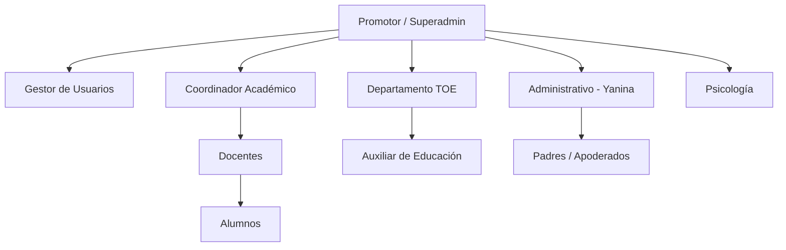
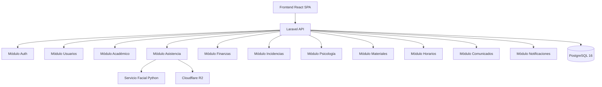
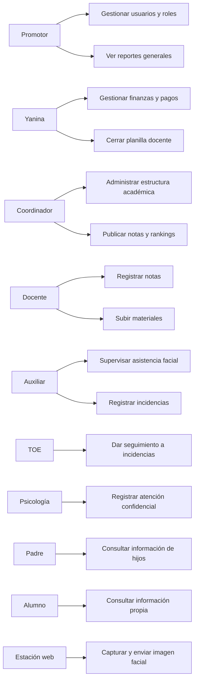
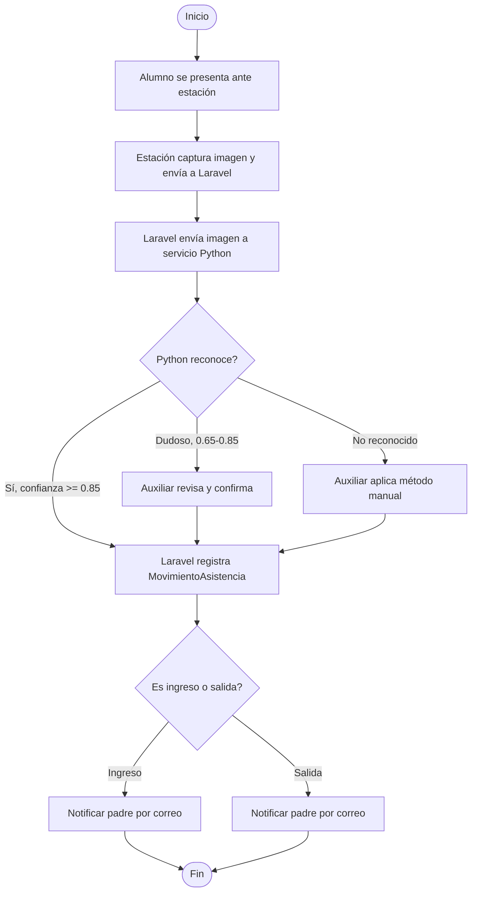
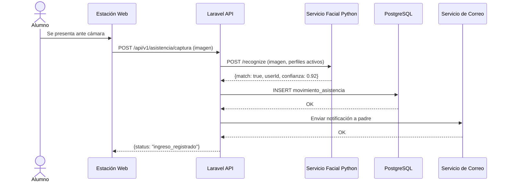
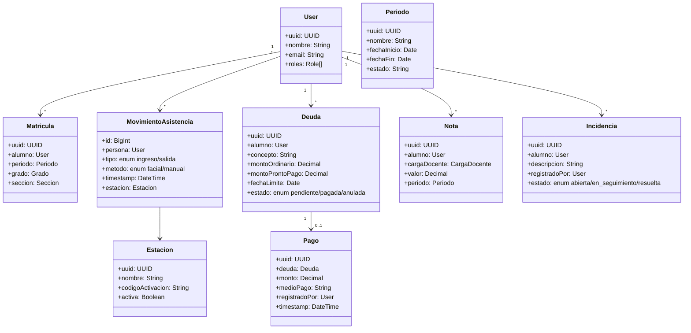

**UNIVERSIDAD PRIVADA DE TACNA**

**FACULTAD DE INGENIERÍA**

**Escuela Profesional de Ingeniería de Sistemas**

**Informe de Especificación de Requerimientos**

**Sistema Web Académico y Administrativo CienciasNET**

Curso: *Programación Web 1*

Docente: *Mtro. Tito Fernando Ale Nieto*

Integrantes:

***Zapana Murillo, Kiara Holly (2023077087)***

***Vargas Espinoza, Jefferson Alfonso (2023076820)***

***Yupa Gomez, Fatima Sofia (2023076618)***

***Carbajal Vargas, Andre Alejandro (2023077287)***

***LLanos Niño, Vincenzo Rafael (202307679)***

**Tacna - Perú**

***2026***

\pagebreak

Sistema *Web Académico y Administrativo CienciasNET*

Informe de Especificación de Requerimientos

Versión *1.0*

| CONTROL DE VERSIONES |                     |              |                    |            |                  |
|:--------------------:|:--------------------|:-------------|:-------------------|:-----------|:-----------------|
|       Versión        | Hecha por           | Revisada por | Aprobada por       | Fecha      | Motivo           |
|         1.0          | KZM, JVE, FYG, ACV, VLN | KZM, JVE, FYG, ACV, VLN | T. Ale Nieto | 2026-07-07 | Versión inicial |

# ÍNDICE GENERAL

1. [Introducción](#1-introducción)
2. [Generalidades de la Empresa](#2-generalidades-de-la-empresa)
    1. [Nombre de la Empresa](#21-nombre-de-la-empresa)
    2. [Visión](#22-visión)
    3. [Misión](#23-misión)
    4. [Organigrama](#24-organigrama)
3. [Visionamiento de la Empresa](#3-visionamiento-de-la-empresa)
    1. [Descripcion del problema](#31-descripcion-del-problema)
    2. [Objetivo de Negocios](#32-objetivo-de-negocios)
    3. [Objetivo de diseño](#33-objetivo-de-diseño)
    4. [Alcance del proyecto](#34-alcance-del-proyecto)
    5. [Viabilidad del sistema](#35-viabilidad-del-sistema)
    6. [Informacion obtenida del Levantamiento de informacion](#36-informacion-obtenida-del-levantamiento-de-informacion)
4. [Analisis de procesos](#4-analisis-de-procesos)
    1. [Diagrama de Procesos Actual](#41-diagrama-de-procesos-actual)
    2. [Diagrama de Procesos Propuesto](#42-diagrama-de-procesos-propuesto)
5. [Especificacion de Requerimientos de Software](#5-especificacion-de-requerimientos-de-software)
    1. [Cuadro de Requerimientos funcionales Inicial](#51-cuadro-de-requerimientos-funcionales-inicial)
    2. [Cuadro de Requerimientos no funcionales](#52-cuadro-de-requerimientos-no-funcionales)
    3. [Cuadro de Requerimientos funcionales Final](#53-cuadro-de-requerimientos-funcionales-final)
    4. [Regla de Negocio](#54-regla-de-negocio)
6. [Fase de Desarrollo](#6-fase-de-desarrollo)
    1. [Perfil del Usuario](#61-perfil-del-usuario)
    2. [Modelo Conceptual](#62-modelo-conceptual)
        1. [Diagrama de paquetes](#621-diagrama-de-paquetes)
        2. [Diagrama de casos de uso](#622-diagrama-de-casos-de-uso)
        3. [Escenarios de casos de uso (narrativas)](#623-escenarios-de-casos-de-uso-narrativas)
    3. [Modelo Lógico](#63-modelo-lógico)
        1. [Analisis de Objetos](#631-analisis-de-objetos)
        2. [Diagrama de Actividades con objetos](#632-diagrama-de-actividades-con-objetos)
        3. [Diagrama de secuencia](#633-diagrama-de-secuencia)
        4. [Diagrama de clases](#634-diagrama-de-clases)
7. [Conclusiones](#7-conclusiones)
8. [Recomendaciones](#8-recomendaciones)
9. [Bibliografia](#9-bibliografia)
10. [Webgrafia](#10-webgrafia)

\pagebreak

# 1. Introducción

El presente Informe de Especificación de Requerimientos de Software (ERS) define, de manera verificable, las capacidades
funcionales y no funcionales del sistema *CienciasNET*. Este documento integra la visión del proyecto (FD02), la
factibilidad evaluada (FD01) y los requerimientos aprobados por el cliente (Colegio Ciencias) para asegurar trazabilidad
real entre requisitos, implementación y pruebas.

El sistema está orientado a centralizar la operación académica, administrativa, financiera y disciplinaria del Colegio
Ciencias, con control de asistencia mediante reconocimiento facial, portales diferenciados por rol y una arquitectura
API-First con Laravel, React, PostgreSQL y Python.

# 2. Generalidades de la Empresa

## 2.1 Nombre de la empresa

Colegio Ciencias — Tacna, Perú.

## 2.2 Visión

Ser una institución educativa líder en Tacna, reconocida por la calidad de su formación integral, la seguridad de su
entorno escolar y la transparencia de su gestión académica y administrativa.

## 2.3 Misión

Brindar educación de calidad con valores, apoyada en herramientas tecnológicas que faciliten la comunicación entre la
comunidad educativa y aseguren el bienestar integral de los estudiantes.

## 2.4 Organigrama

# 3. Visionamiento de la Empresa

## 3.1 Descripcion del problema

El Colegio Ciencias gestiona su operación con procesos predominantemente manuales: asistencia por lista física, notas
en formatos individuales, cobros en hojas de cálculo, incidencias en cuadernos físicos y comunicados por WhatsApp. Esta
dispersión genera errores, pérdida de información, falta de trazabilidad e imposibilidad de consulta en tiempo real por
parte de directivos, padres y alumnos.

## 3.2 Objetivo de negocios

Centralizar toda la operación del Colegio Ciencias en una plataforma web segura que reduzca tiempos operativos, elimine
errores manuales, mejore la seguridad del entorno escolar con reconocimiento facial y ofrezca transparencia a padres de
familia mediante portales de consulta en tiempo real.

## 3.3 Objetivo de diseño

Diseñar una solución web API-First con:

- Backend modular en Laravel 13 con módulos por dominio.
- Frontend SPA en React + TypeScript + Vite con portales por rol.
- Base de datos PostgreSQL 16 con UUID para dominio y BIGSERIAL para auditoría.
- Servicio facial Python/FastAPI independiente.
- Despliegue reproducible con Docker Compose en VPS Hetzner.

## 3.4 Alcance del proyecto

**Incluido en V1:**

- 8 módulos funcionales: Usuarios, Estructura académica, Asistencia alumnos, Asistencia/planilla docente, Finanzas,
  Evaluaciones, Incidencias/Psicología, Materiales/Horarios/Comunicados.
- 10 roles diferenciados con portales personalizados.
- Reconocimiento facial con estaciones web y método manual alternativo.
- Notificaciones por panel responsive y correo electrónico.

**Fuera de alcance en V1:**

- App móvil nativa, pasarela de pagos, exámenes en línea, WhatsApp/SMS, multi-tenancy.

## 3.5 Viabilidad del sistema

Con base en FD01, la viabilidad del sistema es **alta** en dimensiones técnica, operativa, económica, legal, social y
ambiental. El stack tecnológico es maduro y open-source, el modelo de negocio cubre la inversión y el cliente ha
aprobado los requerimientos.

## 3.6 Informacion obtenida del levantamiento de informacion

Fuentes de entrada para este ERS:

- Acta de reunión con requerimientos aprobados (`docs/product/approved-requirements.md`).
- Documento de factibilidad (`docs/fds/FD01-Informe-Factibilidad.md`).
- Documento de visión (`docs/fds/FD02-Informe-Vision.md`).
- Modelo de negocio (`docs/product/business-model.md`).
- Roles y permisos (`docs/product/roles-and-permissions.md`).
- Arquitectura general (`docs/architecture/system.md`).
- Esquema de base de datos (`docs/architecture/database-schema.md`).

# 4. Analisis de procesos

## 4.1 Diagrama de procesos actual

Proceso manual sin sistema integrado.

## 4.2 Diagrama de procesos propuesto

Proceso automatizado con CienciasNET.

# 5. Especificacion de Requerimientos de Software

## 5.1 Cuadro de requerimientos funcionales inicial

| ID     | Requerimiento funcional inicial             | Criterio general de aceptación                                           |
|--------|---------------------------------------------|--------------------------------------------------------------------------|
| RFI-01 | Autenticar usuarios por rol                 | Login con Sanctum, redirección a portal según rol asignado               |
| RFI-02 | Gestionar cuentas y vínculos                | CRUD de usuarios, asignación de roles y vinculación padre-alumno         |
| RFI-03 | Administrar estructura académica            | Crear y gestionar períodos, grados, secciones, cursos y cargas docentes  |
| RFI-04 | Registrar asistencia facial                 | Identificación facial en estación web con registro automático            |
| RFI-05 | Gestionar pagos y deudas                    | Generación de deudas, registro de pagos y consulta de estado de cuenta   |
| RFI-06 | Registrar y publicar evaluaciones           | Docente registra notas, sistema genera rankings y libretas               |
| RFI-07 | Registrar incidencias                       | Auxiliar registra, TOE da seguimiento, Psicología atiende               |
| RFI-08 | Consultar información por portal            | Padre y alumno acceden a datos vinculados o propios                      |

## 5.2 Cuadro de requerimientos no funcionales

| ID     | Requerimiento no funcional      | Métrica / Umbral                                                 | Evidencia esperada                                   |
|--------|---------------------------------|------------------------------------------------------------------|------------------------------------------------------|
| RNF-01 | Seguridad de datos de menores   | HTTPS, Policies, R2 privado, auditoría                           | Cero filtraciones de datos sensibles                 |
| RNF-02 | Rendimiento facial              | Reconocimiento en <= 5 segundos                                  | Timeout configurado y medición en producción         |
| RNF-03 | Disponibilidad                  | >= 95% uptime mensual                                            | Health checks y alertas                              |
| RNF-04 | Usabilidad responsive           | Interfaz funcional en PC, tablet y celular                       | Pruebas en múltiples dispositivos                    |
| RNF-05 | Mantenibilidad                  | Módulos independientes con contratos API                         | Arquitectura documentada y pruebas por módulo        |
| RNF-06 | Escalabilidad                   | Soporte para 300+ alumnos, 30+ docentes                         | Pruebas de carga en entorno de referencia            |
| RNF-07 | Auditabilidad                   | Registro de operaciones sensibles                                | Logs estructurados sin datos secretos                |
| RNF-08 | Backups                         | Diarios cifrados con retención 30 días, RPO 24h, RTO 4h         | Restauración probada trimestralmente                 |

## 5.3 Cuadro de requerimientos funcionales final

| ID    | Requerimiento funcional final                                                         | Prioridad | Módulo responsable          |
|-------|---------------------------------------------------------------------------------------|-----------|-----------------------------|
| RF-01 | Autenticación Sanctum con sesión SPA para personas y credencial técnica para estaciones | Alta      | Auth                        |
| RF-02 | CRUD de usuarios con 10 roles, permisos granulares y Policies                          | Alta      | Usuarios                    |
| RF-03 | Vinculación padre-alumno (muchos a muchos) y selección de contexto por rol             | Alta      | Usuarios                    |
| RF-04 | Gestión de períodos, grados, secciones, cursos, matrículas y cargas docentes           | Alta      | Academico                   |
| RF-05 | Activación de estaciones web mediante QR/código temporal sin sesión personal            | Alta      | Asistencia                  |
| RF-06 | Reconocimiento facial con prueba de vida, umbrales configurables y método manual        | Alta      | Asistencia / Facial         |
| RF-07 | Registro de ingresos/salidas con reglas de horario y generación de faltas al cierre    | Alta      | Asistencia                  |
| RF-08 | Notificación automática a padres por correo ante ingreso, salida y emergencia          | Alta      | Asistencia / Notificaciones |
| RF-09 | Supervisión y resolución de excepciones de asistencia por Auxiliar                      | Alta      | Asistencia                  |
| RF-10 | Asistencia docente facial con cálculo de tardanzas contra primera clase programada     | Alta      | Asistencia                  |
| RF-11 | Planilla docente: tardanza, falta justificada/injustificada, sustituto y liquidación    | Alta      | Asistencia / Finanzas       |
| RF-12 | Gestión de conceptos de cobro, becas, descuentos y generación automática de deudas     | Alta      | Finanzas                    |
| RF-13 | Registro manual de pagos (efectivo, transferencia, Yape, Plin) con inmutabilidad        | Alta      | Finanzas                    |
| RF-14 | Estado de cuenta de alumnos con historial de deudas y pagos                             | Alta      | Finanzas                    |
| RF-15 | Registro de notas por docente según carga, con validación de período y sección          | Alta      | Academico                   |
| RF-16 | Rankings automáticos y generación de libretas por período                                | Media     | Academico                   |
| RF-17 | Cuaderno de incidencias virtual con flujo Auxiliar → TOE → Psicología                  | Media     | Incidencias / Psicología    |
| RF-18 | Registro confidencial de atenciones psicológicas (solo Psicología y superadmin)         | Media     | Psicología                  |
| RF-19 | Subida y consulta de materiales de estudio por curso                                    | Baja      | Materiales                  |
| RF-20 | Gestión de horarios y calendario escolar                                                | Baja      | Horarios                    |
| RF-21 | Comunicados segmentados con confirmación de lectura                                     | Baja      | Comunicados                 |
| RF-22 | Portal padre: notas, asistencia, estado de cuenta, incidencias de hijos vinculados      | Alta      | Frontend                    |
| RF-23 | Portal alumno: notas, asistencia, horarios, materiales y comunicados propios            | Media     | Frontend                    |

## 5.4 Regla de negocio

| ID    | Regla de negocio                                                                                          | Aplicación                              |
|-------|-----------------------------------------------------------------------------------------------------------|-----------------------------------------|
| RN-01 | No existe autorregistro; todas las cuentas son creadas por superadmin o gestor de usuarios                 | Módulo Usuarios                         |
| RN-02 | Un padre puede vincularse a varios alumnos y un alumno a varios padres                                    | Vinculación padre-alumno                |
| RN-03 | El primer pase facial del día es ingreso, el siguiente es salida; presencia sin salida crea anomalía       | Módulo Asistencia                       |
| RN-04 | La falta se genera al cierre configurable de la jornada si no existió ningún ingreso                       | Módulo Asistencia                       |
| RN-05 | Solo TOE o Auxiliar pueden justificar faltas de alumnos                                                   | Módulo Asistencia                       |
| RN-06 | La tardanza docente se calcula contra la primera clase programada del día                                  | Planilla docente                        |
| RN-07 | Cada deuda se paga en una sola operación (no existen pagos parciales)                                     | Módulo Finanzas                         |
| RN-08 | Las deudas pagadas/anuladas y los movimientos históricos nunca se modifican                                | Módulo Finanzas                         |
| RN-09 | Yanina es la única cuenta autorizada para gestión financiera y cierre de planilla                          | Permisos específicos                    |
| RN-10 | Las atenciones psicológicas son confidenciales, visibles solo por Psicología y superadmin                  | Módulo Psicología                       |
| RN-11 | Las estaciones web usan sesiones técnicas y nunca reciben la sesión personal de un trabajador              | Módulo Asistencia                       |
| RN-12 | El enrolamiento facial requiere consentimiento registrado de padres                                       | Servicio facial                         |

# 6. Fase de Desarrollo

## 6.1 Perfil del usuario

| Perfil                       | Características                                     | Necesidades principales                          |
|------------------------------|-----------------------------------------------------|--------------------------------------------------|
| Promotor (superadmin)        | Director con acceso total al sistema                | Control completo, reportes y visibilidad         |
| Administrativo (Yanina)      | Gestión financiera y planilla docente               | Exactitud en cálculos y auditoría                |
| Coordinador académico        | Gestión de estructura y evaluaciones                | Administración de períodos, cursos y notas       |
| Docente                      | Registro de notas de sus cursos asignados           | Formularios simples y consulta de horarios       |
| Auxiliar                     | Supervisión de asistencia y registro de incidencias | Flujos guiados y resolución de excepciones       |
| Padre / Apoderado            | Consulta de información de hijos                    | Portal claro, rápido y accesible desde móvil     |
| Alumno                       | Consulta de información propia                      | Acceso a notas, horarios y materiales            |

## 6.2 Modelo Conceptual

### 6.2.1 Diagrama de paquetes

### 6.2.2 Diagrama de casos de uso

### 6.2.3 Escenarios de casos de uso (narrativas)

| Caso de uso                           | Actor      | Flujo principal                                                                                                           | Resultado                                             |
|---------------------------------------|------------|---------------------------------------------------------------------------------------------------------------------------|-------------------------------------------------------|
| CU-01 Registrar asistencia facial     | Alumno     | Se presenta ante estación; Python identifica rostro; Laravel valida y registra                                            | Ingreso/salida registrado, padre notificado por correo |
| CU-02 Gestionar pagos                 | Yanina     | Selecciona alumno, registra pago recibido, sistema actualiza estado de cuenta                                            | Deuda pagada e inmutable, movimiento auditado          |
| CU-03 Registrar notas                 | Docente    | Selecciona curso/sección, ingresa notas por alumno, confirma                                                             | Notas guardadas y disponibles para ranking             |
| CU-04 Consultar estado de cuenta      | Padre      | Accede al portal, selecciona hijo, visualiza deudas pendientes y pagos realizados                                        | Estado de cuenta en tiempo real                        |
| CU-05 Registrar incidencia            | Auxiliar   | Describe incidencia, asigna alumno(s), envía a TOE                                                                       | Incidencia registrada con historial de seguimiento     |
| CU-06 Cerrar planilla mensual         | Yanina     | Revisa asistencia docente del mes, sistema calcula descuentos, Yanina confirma cierre                                    | Liquidación mensual cerrada e inmutable                |

## 6.3 Modelo Lógico

### 6.3.1 Analisis de objetos

| Objeto                    | Responsabilidad                                                    | Tipo                          |
|---------------------------|--------------------------------------------------------------------|-------------------------------|
| `User`                    | Representar una cuenta con roles y permisos                        | Entidad de dominio            |
| `Periodo`                 | Definir período académico con fechas y estado                      | Entidad de dominio            |
| `Grado` / `Seccion`       | Organizar estructura académica                                     | Entidad de dominio            |
| `Matricula`               | Vincular alumno con grado/sección en un período                    | Relación de dominio           |
| `CargaDocente`            | Asignar docente a curso/sección                                    | Relación de dominio           |
| `MovimientoAsistencia`    | Registrar un pase (ingreso/salida) con timestamp y método          | Evento de dominio             |
| `Deuda`                   | Representar obligación financiera congelada                        | Entidad financiera            |
| `Pago`                    | Registrar pago completo e inmutable                                | Evento financiero             |
| `Nota`                    | Registrar resultado de evaluación por alumno/curso                  | Entidad académica             |
| `Incidencia`              | Registrar evento disciplinario con flujo de derivación             | Entidad de seguimiento        |
| `AtencionPsicologica`     | Registrar atención confidencial                                    | Entidad protegida             |
| `Estacion`                | Representar dispositivo activado para asistencia facial            | Entidad de infraestructura    |

### 6.3.2 Diagrama de actividades con objetos

### 6.3.3 Diagrama de secuencia

### 6.3.4 Diagrama de clases

# 7. Conclusiones

1. El ERS define requerimientos verificables y trazables a los módulos reales del proyecto, reduciendo ambigüedad
   documental.
2. Los 23 requerimientos funcionales y 8 no funcionales cubren la operación completa del Colegio Ciencias.
3. Las 12 reglas de negocio reflejan las decisiones aprobadas con el cliente en la reunión de levantamiento.
4. Los diagramas de proceso, casos de uso, secuencia y clases documentan el flujo desde la perspectiva del usuario y
   la arquitectura técnica.
5. La arquitectura modular (módulos por dominio en Laravel) facilita el desarrollo incremental y el mantenimiento.

# 8. Recomendaciones

1. Mantener sincronizados FD01, FD02, FD03 y los documentos de producto en `docs/` al cerrar cada módulo.
2. Validar cada módulo con el cliente antes de avanzar al siguiente para evitar retrabajos.
3. Implementar pruebas Feature con Pest para cada endpoint del contrato API.
4. Realizar pruebas de reconocimiento facial en condiciones reales del colegio (iluminación, cámaras).
5. Definir métricas de adopción por rol para evaluar el impacto real del sistema.

# 9. Bibliografia

1. Pressman, R. S., & Maxim, B. R. (2020). *Software Engineering: A Practitioner's Approach*.
2. Sommerville, I. (2016). *Software Engineering*.
3. ISO/IEC 25010:2011. *Systems and software quality models*.
4. Laravel LLC. (2026). *Laravel Documentation*.
5. Meta Platforms. (2026). *React Documentation*.
6. The PostgreSQL Global Development Group. (2026). *PostgreSQL Documentation*.
7. Tiangolo, S. (2026). *FastAPI Documentation*.

# 10. Webgrafia

- Repositorio del proyecto: `README.md`
- Requerimientos aprobados: `docs/product/approved-requirements.md`
- Roles y permisos: `docs/product/roles-and-permissions.md`
- Arquitectura general: `docs/architecture/system.md`
- Backend modular: `docs/architecture/backend.md`
- Frontend SPA: `docs/architecture/frontend.md`
- Esquema de base de datos: `docs/architecture/database-schema.md`
- https://laravel.com/docs
- https://react.dev/
- https://www.postgresql.org/docs/
- https://fastapi.tiangolo.com/
- https://vitejs.dev/
