

**UNIVERSIDAD PRIVADA DE TACNA**

**FACULTAD DE INGENIERÍA**

**Escuela Profesional de Ingeniería de Sistemas**

**Informe de Arquitectura de Software**

**Sistema Web Académico y Administrativo CienciasNET**

Curso: *Programación Web 1*

Docente: *Mtro. Tito Fernando Ale Nieto*

Integrantes:

***Zapana Murillo, Kiara Holly (2023077087)***

***Vargas Espinoza, Jefferson Alfonso (2023076820)***

***Yupa Gomez, Fatima Sofia (2023076618)***

***Carbajal Vargas, Andre Alejandro (2023077287)***

***LLanos Niño, Vincenzo Rafael (202307679)***

**Tacna - Perú**

***2026***

\pagebreak

Sistema *Web Académico y Administrativo CienciasNET*

Informe de Arquitectura de Software

Versión *1.0*

| CONTROL DE VERSIONES |                     |              |                    |            |                  |
|:--------------------:|:--------------------|:-------------|:-------------------|:-----------|:-----------------|
|       Versión        | Hecha por           | Revisada por | Aprobada por       | Fecha      | Motivo           |
|         1.0          | KZM, JVE, FYG, ACV, VLN | KZM, JVE, FYG, ACV, VLN | T. Ale Nieto | 2026-07-07 | Versión inicial |

# ÍNDICE GENERAL

1. [Introducción](#1-introducción)
    1. [Propósito (Diagrama 4+1)](#11-propósito-diagrama-41)
    2. [Alcance](#12-alcance)
    3. [Definiciones, siglas y abreviaturas](#13-definiciones-siglas-y-abreviaturas)
    4. [Organización del documento](#14-organización-del-documento)
2. [Objetivos y restricciones arquitectónicas](#2-objetivos-y-restricciones-arquitectónicas)
    1. [Priorización de requerimientos](#21-priorización-de-requerimientos)
        1. [Requerimientos funcionales](#211-requerimientos-funcionales)
        2. [Requerimientos no funcionales](#212-requerimientos-no-funcionales)
    2. [Restricciones arquitectónicas](#22-restricciones-arquitectónicas)
3. [Representación de la arquitectura del sistema](#3-representación-de-la-arquitectura-del-sistema)
    1. [Vista de uso](#31-vista-de-uso)
        1. [Diagrama de casos de uso](#311-diagrama-de-casos-de-uso)
    2. [Vista lógica](#32-vista-lógica)
        1. [Diagrama de sub-sistemas (paquetes)](#321-diagrama-de-sub-sistemas-paquetes)
        2. [Diagrama de secuencia (vista de diseño)](#322-diagrama-de-secuencia-vista-de-diseño)
        3. [Diagrama de colaboración (vista de diseño)](#323-diagrama-de-colaboración-vista-de-diseño)
        4. [Diagrama de objetos](#324-diagrama-de-objetos)
        5. [Diagrama de clases](#325-diagrama-de-clases)
        6. [Diagrama de base de datos](#326-diagrama-de-base-de-datos)
    3. [Vista de implementación (vista de desarrollo)](#33-vista-de-implementación-vista-de-desarrollo)
        1. [Diagrama de arquitectura de software](#331-diagrama-de-arquitectura-de-software)
        2. [Diagrama de arquitectura del sistema (diagrama de componentes)](#332-diagrama-de-arquitectura-del-sistema-diagrama-de-componentes)
    4. [Vista de procesos](#34-vista-de-procesos)
        1. [Diagrama de procesos del sistema (diagrama de actividades)](#341-diagrama-de-procesos-del-sistema-diagrama-de-actividades)
    5. [Vista de despliegue](#35-vista-de-despliegue)
        1. [Diagrama de despliegue](#351-diagrama-de-despliegue)
4. [Atributos de calidad del software](#4-atributos-de-calidad-del-software)
    1. [Escenario de funcionalidad](#41-escenario-de-funcionalidad)
    2. [Escenario de usabilidad](#42-escenario-de-usabilidad)
    3. [Escenario de confiabilidad](#43-escenario-de-confiabilidad)
    4. [Escenario de rendimiento](#44-escenario-de-rendimiento)
    5. [Escenario de mantenibilidad](#45-escenario-de-mantenibilidad)
    6. [Otros escenarios de calidad](#46-otros-escenarios-de-calidad)

\pagebreak

# 1. Introducción

## 1.1 Propósito (Diagrama 4+1)

Este informe describe la arquitectura de software de *CienciasNET* siguiendo el enfoque 4+1, articulando las vistas
de uso, lógica, implementación, procesos y despliegue, y vinculándolas con los requerimientos establecidos en FD03 y las
restricciones de FD01/FD02.

Las decisiones de arquitectura priorizan:

- Separación estricta entre frontend SPA y backend API (API-First).
- Seguridad de datos de menores, biometría y registros confidenciales.
- Modularidad por dominio para facilitar desarrollo paralelo y mantenimiento.
- Despliegue reproducible con Docker Compose en VPS.

## 1.2 Alcance

Este documento cubre la arquitectura del sistema implementado en la versión actual del proyecto, incluyendo:

- Arquitectura API-First con contratos OpenAPI.
- Backend modular Laravel con módulos por dominio.
- Frontend SPA React con portales por rol.
- Servicio facial Python/FastAPI independiente.
- Base de datos PostgreSQL con esquema normalizado.
- Despliegue en VPS Hetzner con Nginx, Docker Compose y Cloudflare R2.

## 1.3 Definiciones, siglas y abreviaturas

| Término      | Definición                                                                    |
|--------------|-------------------------------------------------------------------------------|
| API          | Interfaz de programación de aplicaciones para comunicación entre sistemas.    |
| API-First    | Diseño donde el contrato API se define y aprueba antes de implementar.        |
| CI/CD        | Integración continua y entrega continua.                                      |
| CORS         | Compartición de recursos entre orígenes, política de seguridad del navegador. |
| CRUD         | Operaciones de Crear, Leer, Actualizar y Eliminar.                           |
| FD01-FD03    | Informes previos de Factibilidad, Visión y Requerimientos.                   |
| HTTPS        | Protocolo HTTP seguro con cifrado TLS.                                       |
| R2           | Servicio de almacenamiento de objetos de Cloudflare.                         |
| Sanctum      | Paquete de Laravel para autenticación SPA y API tokens.                       |
| SPA          | Single Page Application, aplicación de una sola página.                      |
| UUID         | Identificador único universal.                                               |
| VPS          | Servidor virtual privado.                                                    |

## 1.4 Organización del documento

- Sección 2: presenta objetivos arquitectónicos y priorización de requerimientos.
- Sección 3: documenta las vistas arquitectónicas con diagramas Mermaid.
- Sección 4: define escenarios de atributos de calidad con criterios verificables.

# 2. Objetivos y restricciones arquitectónicas

## 2.1 Priorización de requerimientos

### 2.1.1 Requerimientos funcionales

| ID    | Descripción                                                               | Prioridad |
|-------|---------------------------------------------------------------------------|-----------|
| RF-01 | Autenticación Sanctum con sesión SPA y credencial técnica                 | Alta      |
| RF-02 | Gestión de usuarios con 10 roles y permisos granulares                    | Alta      |
| RF-04 | Estructura académica (períodos, grados, secciones, cursos, cargas)        | Alta      |
| RF-06 | Reconocimiento facial con prueba de vida y umbrales configurables         | Alta      |
| RF-07 | Registro de ingresos/salidas con generación de faltas al cierre           | Alta      |
| RF-12 | Gestión financiera: conceptos, becas, descuentos, deudas y pagos          | Alta      |
| RF-15 | Registro de notas por docente y generación de rankings                    | Alta      |
| RF-17 | Cuaderno de incidencias con flujo de derivación                           | Media     |
| RF-22 | Portal padre con consulta de información de hijos                         | Alta      |

### 2.1.2 Requerimientos no funcionales

| ID     | Descripción                                         | Prioridad |
|--------|-----------------------------------------------------|-----------|
| RNF-01 | Seguridad de datos de menores y biometría           | Alta      |
| RNF-02 | Rendimiento facial <= 5 segundos                    | Alta      |
| RNF-03 | Disponibilidad >= 95% uptime                        | Alta      |
| RNF-04 | Interfaz responsive en PC, tablet y celular         | Alta      |
| RNF-05 | Arquitectura modular por dominio                    | Alta      |
| RNF-06 | Soporte para 300+ alumnos y 30+ docentes            | Media     |
| RNF-07 | Auditoría de operaciones sensibles                  | Alta      |
| RNF-08 | Backups cifrados diarios con RPO 24h y RTO 4h       | Alta      |

## 2.2 Restricciones arquitectónicas

| Restricción                                          | Implicancia de diseño                                                                   |
|------------------------------------------------------|-----------------------------------------------------------------------------------------|
| API-First con contratos OpenAPI                      | Backend y frontend se desarrollan contra contratos aprobados, no contra implementación. |
| Laravel 13 + PHP 8.3+                                | Backend API con Eloquent, Sanctum, Spatie Permission, colas y Policies.                 |
| React + TypeScript + Vite                            | Frontend SPA con portales por rol, sin SSR ni acceso directo a DB.                      |
| PostgreSQL 16                                        | UUID para dominio, BIGSERIAL para auditoría, constraints e índices.                     |
| Servicio facial Python independiente                 | Solo reconoce rostros; no accede a DB ni registra asistencia directamente.              |
| Datos de menores y biometría                         | HTTPS obligatorio, R2 privado, auditoría, Policies estrictas.                           |
| Docker Compose                                       | Entorno reproducible para desarrollo y despliegue inicial.                              |
| Inmutabilidad financiera                             | Deudas pagadas y movimientos históricos nunca se modifican.                             |
| No existe autorregistro                              | Todas las cuentas son creadas por superadmin o gestor de usuarios.                      |

# 3. Representación de la arquitectura del sistema

## 3.1 Vista de uso

Esta vista muestra cómo los actores interactúan con las capacidades centrales del sistema.

### 3.1.1 Diagrama de casos de uso

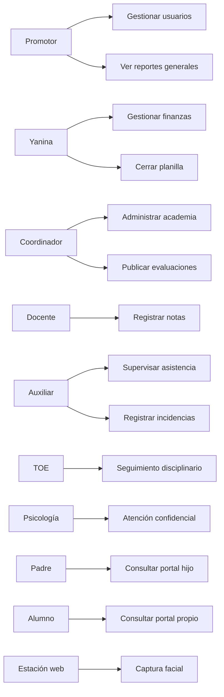

## 3.2 Vista lógica

La vista lógica refleja la descomposición del sistema en subsistemas y sus colaboraciones.

### 3.2.1 Diagrama de sub-sistemas (paquetes)

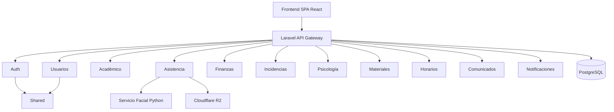

### 3.2.2 Diagrama de secuencia (vista de diseño)

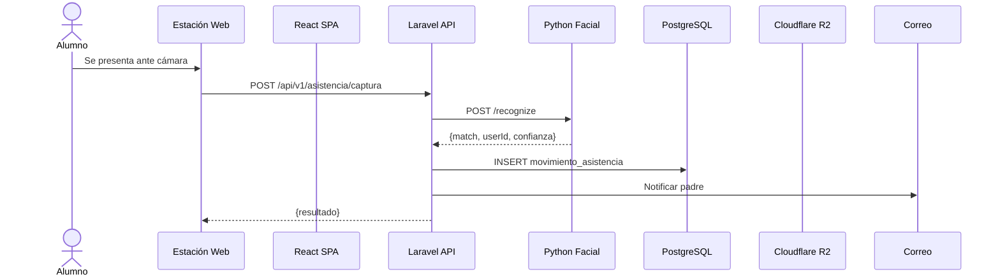

### 3.2.3 Diagrama de colaboración (vista de diseño)

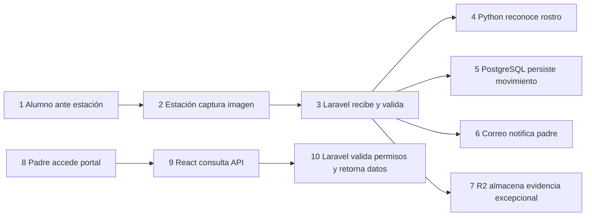

### 3.2.4 Diagrama de objetos

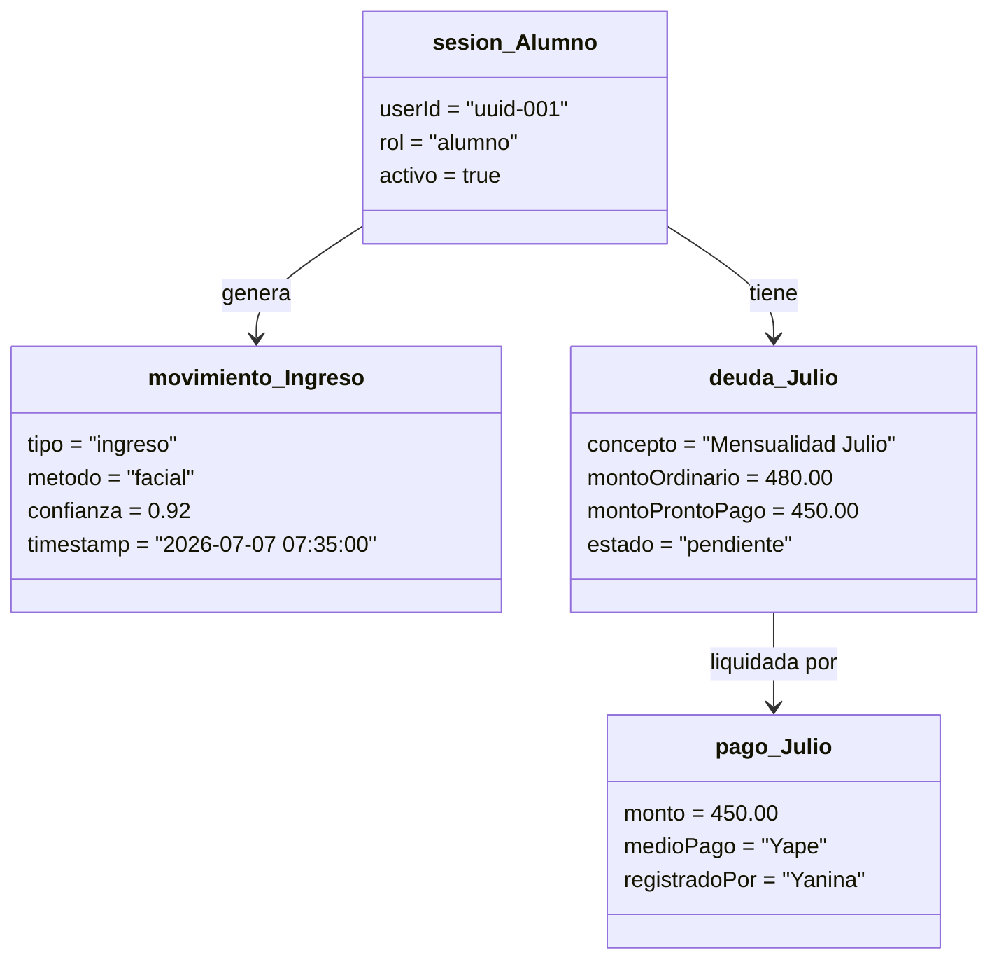

### 3.2.5 Diagrama de clases

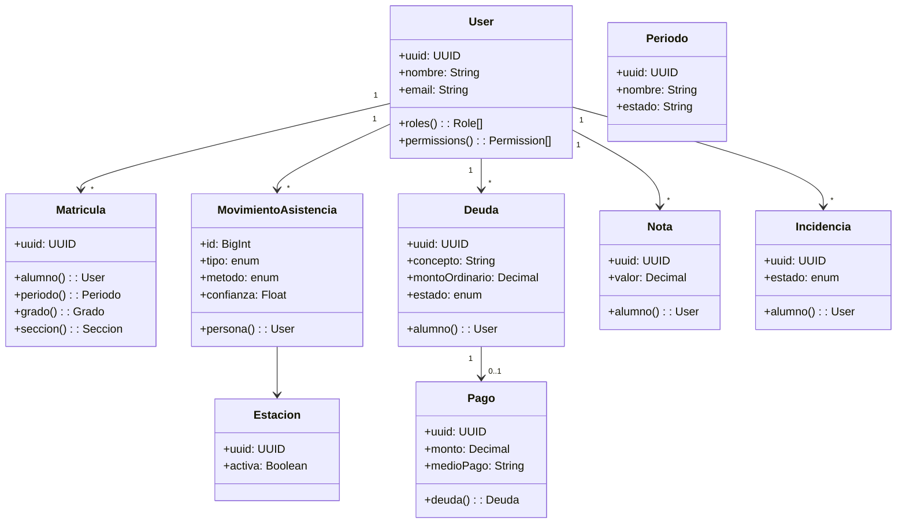

### 3.2.6 Diagrama de base de datos

El sistema utiliza PostgreSQL 16 con UUID para recursos de dominio y BIGSERIAL para registros de auditoría. El esquema
completo se documenta en `docs/architecture/database-schema.md`.

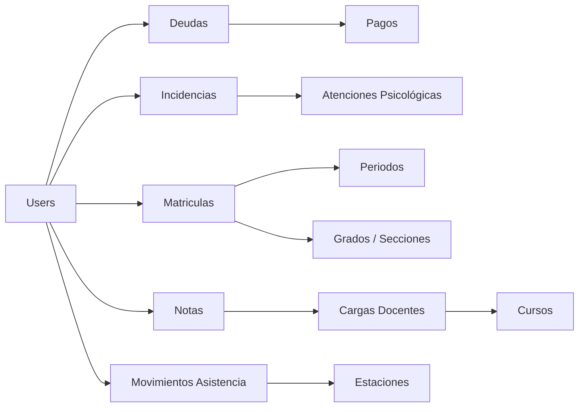

## 3.3 Vista de implementación (vista de desarrollo)

Describe cómo el diseño lógico se materializa en componentes de código y capas de responsabilidad.

### 3.3.1 Diagrama de arquitectura de software

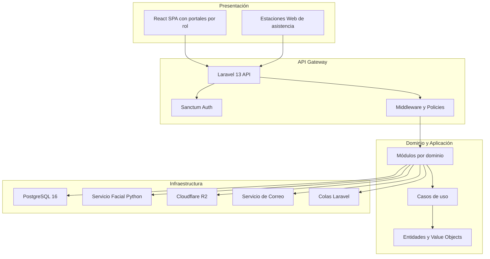

### 3.3.2 Diagrama de arquitectura del sistema (diagrama de componentes)

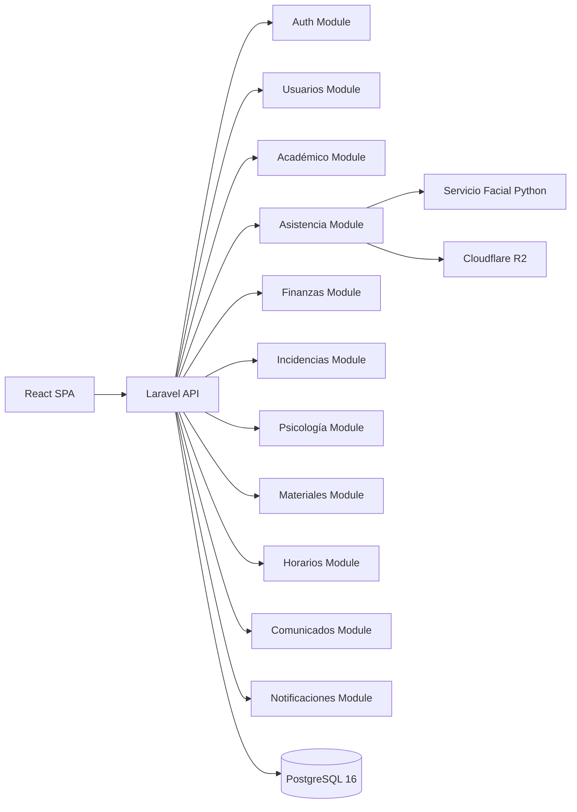

## 3.4 Vista de procesos

Modela la coordinación de tareas en ejecución, incluyendo escenarios de horario pico y degradación.

### 3.4.1 Diagrama de procesos del sistema (diagrama de actividades)

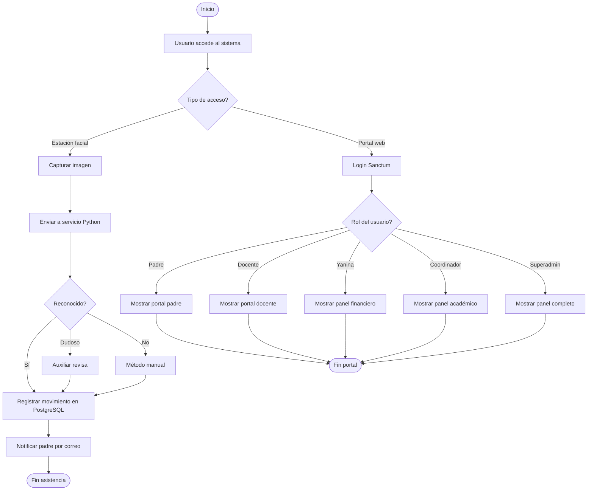

## 3.5 Vista de despliegue

Presenta los escenarios de ejecución física del sistema en producción y desarrollo.

### 3.5.1 Diagrama de despliegue

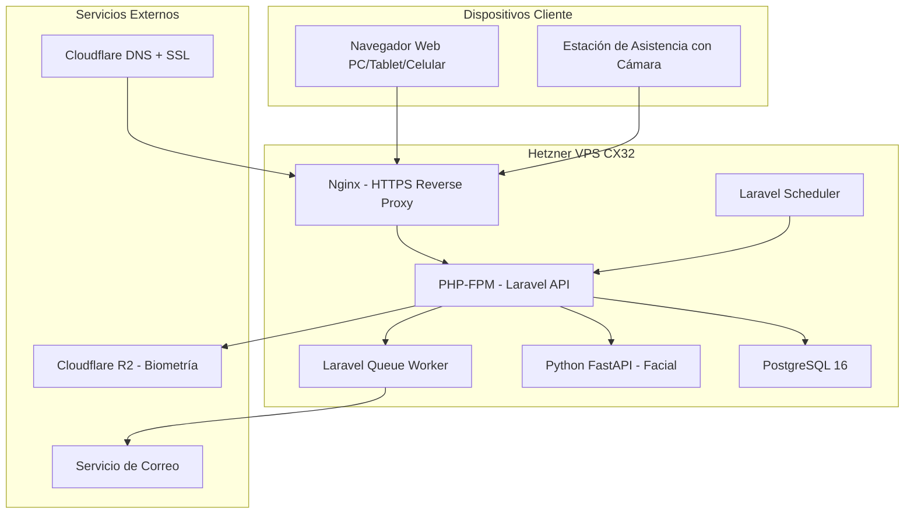

# 4. Atributos de calidad del software

## 4.1 Escenario de funcionalidad

| Elemento            | Definición                                                                      |
|---------------------|---------------------------------------------------------------------------------|
| Fuente de estímulo  | Alumno, docente, padre, Yanina o estación web                                   |
| Estímulo            | Acceder al sistema para operación académica, financiera o de asistencia         |
| Entorno             | Navegador web con conexión a internet                                           |
| Respuesta           | Sistema ejecuta la operación solicitada según permisos del rol                  |
| Medida de respuesta | Cobertura funcional alineada con los 23 RF priorizados en FD03                  |

## 4.2 Escenario de usabilidad

| Elemento            | Definición                                                                       |
|---------------------|----------------------------------------------------------------------------------|
| Fuente de estímulo  | Personal no técnico del colegio, padres y alumnos                                |
| Estímulo            | Necesita realizar operaciones o consultar información sin capacitación avanzada  |
| Entorno             | Navegador web en PC, tablet o celular                                            |
| Respuesta           | Interfaz responsive con portales claros por rol, formularios guiados             |
| Medida de respuesta | >= 80% del personal operando sin asistencia después de capacitación              |

## 4.3 Escenario de confiabilidad

| Elemento            | Definición                                                                                |
|---------------------|-------------------------------------------------------------------------------------------|
| Fuente de estímulo  | Fallo de red, error del servicio facial, o indisponibilidad de correo                     |
| Estímulo            | Error en un componente externo durante operación normal                                   |
| Entorno             | Horario pico de asistencia (7:00 - 7:45 AM)                                              |
| Respuesta           | Degradación controlada: método manual alternativo, reintentos y colas                     |
| Medida de respuesta | El sistema no se detiene por fallo parcial; el Auxiliar resuelve excepciones               |

## 4.4 Escenario de rendimiento

| Elemento            | Definición                                                                   |
|---------------------|------------------------------------------------------------------------------|
| Fuente de estímulo  | 300+ alumnos ingresando en ventana de 30-45 minutos                          |
| Estímulo            | Pico de solicitudes de reconocimiento facial simultáneas                     |
| Entorno             | VPS Hetzner CX32 (4 vCPU, 8 GB RAM)                                         |
| Respuesta           | Cada reconocimiento completa en <= 5 segundos                                |
| Medida de respuesta | Throughput suficiente para atender el flujo matutino sin cuellos de botella  |

## 4.5 Escenario de mantenibilidad

| Elemento            | Definición                                                                           |
|---------------------|--------------------------------------------------------------------------------------|
| Fuente de estímulo  | Equipo de desarrollo requiere agregar nuevo módulo o modificar regla de negocio      |
| Estímulo            | Cambio evolutivo solicitado por el cliente                                           |
| Entorno             | Código Laravel modular con pruebas y contratos API                                   |
| Respuesta           | Modificación acotada a un módulo sin impacto en los demás                            |
| Medida de respuesta | Módulos independientes con contratos API y pruebas propias                            |

## 4.6 Otros escenarios de calidad

### 4.6.1 Seguridad

| Elemento            | Definición                                                                        |
|---------------------|-----------------------------------------------------------------------------------|
| Fuente de estímulo  | Intento de acceso a datos de alumno por usuario no autorizado                     |
| Estímulo            | Solicitud HTTP a endpoint protegido sin permisos                                  |
| Entorno             | Producción con HTTPS                                                              |
| Respuesta           | Sanctum valida sesión, Spatie verifica permiso, Policy valida recurso; 403 si falla|
| Medida de respuesta | Cero accesos no autorizados a datos de menores o registros confidenciales          |

### 4.6.2 Auditabilidad

| Elemento            | Definición                                                                     |
|---------------------|--------------------------------------------------------------------------------|
| Fuente de estímulo  | Promotor solicita revisar quién modificó un registro financiero                |
| Estímulo            | Consulta de auditoría sobre operación sensible                                 |
| Entorno             | Panel de administración                                                        |
| Respuesta           | Registro de auditoría con usuario, acción, timestamp y datos afectados         |
| Medida de respuesta | Toda operación financiera, de permisos y de acceso excepcional queda registrada|
