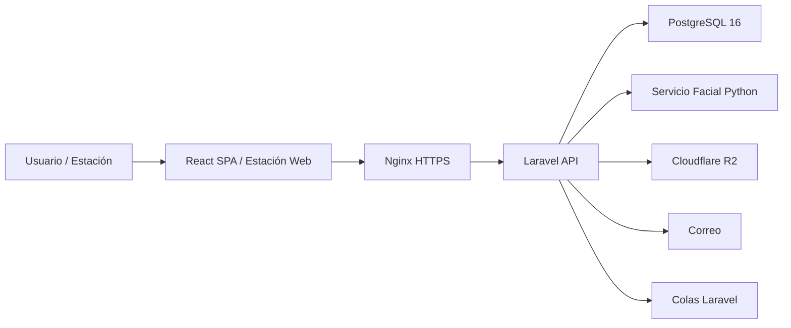

**UNIVERSIDAD PRIVADA DE TACNA**

**FACULTAD DE INGENIERÍA**

**Escuela Profesional de Ingeniería de Sistemas**

**Informe Final de Proyecto**

**Sistema Web Académico y Administrativo CienciasNET**

Curso: *Programación Web 1*

Docente: *Mtro. Tito Fernando Ale Nieto*

Integrantes:

***Zapana Murillo, Kiara Holly (2023077087)***

***Vargas Espinoza, Jefferson Alfonso (2023076820)***

***Yupa Gomez, Fatima Sofia (2023076618)***

***Carbajal Vargas, Andre Alejandro (2023077287)***

***LLanos Niño, Vincenzo Rafael (202307679)***

**Tacna - Perú**

***2026***

\pagebreak

Sistema *Web Académico y Administrativo CienciasNET*

Informe Final de Proyecto

Versión *1.0*

| CONTROL DE VERSIONES |                     |              |                    |            |                  |
|:--------------------:|:--------------------|:-------------|:-------------------|:-----------|:-----------------|
|       Versión        | Hecha por           | Revisada por | Aprobada por       | Fecha      | Motivo           |
|         1.0          | KZM, JVE, FYG, ACV, VLN | KZM, JVE, FYG, ACV, VLN | T. Ale Nieto | 2026-07-07 | Versión final del informe de proyecto |

# ÍNDICE GENERAL

1. [Antecedentes](#antecedentes)
2. [Planteamiento del Problema](#planteamiento-del-problema)
    1. [Problema](#problema)
    2. [Justificación](#justificación)
    3. [Alcance](#alcance)
3. [Objetivos](#objetivos)
    1. [Objetivo General](#objetivo-general)
    2. [Objetivos Específicos](#objetivos-específicos)
4. [Marco Teórico](#marco-teórico)
5. [Desarrollo de la Solución](#desarrollo-de-la-solución)
    1. [Análisis de Factibilidad](#análisis-de-factibilidad)
    2. [Tecnología de Desarrollo](#tecnología-de-desarrollo)
    3. [Metodología de Implementación](#metodología-de-implementación)
    4. [Módulos Implementados](#módulos-implementados)
    5. [Arquitectura y Flujo General](#arquitectura-y-flujo-general)
    6. [Trazabilidad de Requerimientos](#trazabilidad-de-requerimientos)
    7. [Decisiones de Seguridad](#decisiones-de-seguridad)
6. [Cronograma](#cronograma)
7. [Presupuesto](#presupuesto)
8. [Resultados y Discusión](#resultados-y-discusión)
9. [Gestión de Riesgos](#gestión-de-riesgos)
10. [Conclusiones](#conclusiones)
11. [Recomendaciones](#recomendaciones)
12. [Anexos](#anexos)

\pagebreak

# Antecedentes

Los colegios privados del Perú gestionan su operación académica y administrativa con herramientas dispersas: hojas de
cálculo para finanzas, cuadernos físicos para incidencias, listas manuales para asistencia y grupos de WhatsApp para
comunicaciones. Esta fragmentación genera pérdida de información, errores humanos, falta de trazabilidad y demoras en
la toma de decisiones.

El Colegio Ciencias de Tacna opera bajo esta realidad. El registro de asistencia de alumnos se realiza por lista
física o llamado en aula, sin notificación inmediata a padres. Los cobros de matrícula, mensualidades y cuotas se
administran manualmente, dificultando la auditoría y la consulta de estados de cuenta. Las notas se registran en
formatos individuales por docente, y las incidencias se documentan en cuadernos sin posibilidad de seguimiento digital.

Frente a esta problemática, se propuso el desarrollo de **CienciasNET**, una intranet web que centraliza toda la
operación del colegio: usuarios y roles, estructura académica, asistencia facial de alumnos y docentes, planilla
docente, finanzas y pagos, evaluaciones con rankings, incidencias con derivación a TOE y Psicología, materiales,
horarios y comunicados.

La propuesta fue aprobada por la dirección del Colegio Ciencias en una reunión de levantamiento de requerimientos,
documentada en el acta de funcionalidades aprobadas. El sistema se desarrolla con un modelo de negocio de pago único
por desarrollo más mantenimiento mensual.

## Situación Actual y Oportunidad de Mejora

La proliferación de herramientas genéricas en instituciones educativas ha creado un entorno donde la información está
dispersa entre múltiples formatos y canales. El Colegio Ciencias requiere una solución integrada que normalice todos
sus procesos operativos en una plataforma única, accesible desde cualquier dispositivo y con seguridad adecuada para
datos de menores.

CienciasNET aprovecha esta oportunidad mediante una arquitectura API-First que separa frontend y backend, módulos
de dominio independientes, un servicio facial dedicado y portales personalizados por rol. El resultado no pretende
reemplazar las decisiones humanas del personal, sino facilitar y automatizar las tareas operativas que hoy consumen
tiempo y generan errores.

# Planteamiento del Problema

## Problema

El Colegio Ciencias necesita modernizar su operación, pero enfrenta tres limitaciones principales:

1. Los procesos académicos, administrativos, financieros y disciplinarios se gestionan con herramientas dispersas
   y sin integración.
2. El control de acceso de alumnos al centro educativo se realiza de forma manual, sin evidencia digital ni
   notificación automática a padres.
3. La información financiera, académica y disciplinaria no está disponible en tiempo real para directivos, padres
   ni alumnos.

Como resultado, el colegio opera con ineficiencias, riesgos de seguridad y opacidad informativa que afectan la calidad
del servicio educativo.

### Formulación del Problema

¿Cómo centralizar y automatizar la gestión académica, administrativa, financiera y disciplinaria del Colegio Ciencias
en una plataforma web segura, con control de acceso biométrico y portales de consulta diferenciados por rol?

### Causas y Efectos

| Causa identificada | Efecto sobre el colegio |
|--------------------|-------------------------|
| Procesos manuales dispersos | Mayor tiempo operativo y errores de transcripción |
| Asistencia por lista física | Sin evidencia digital, sin notificación a padres, sin reportes |
| Finanzas en hojas de cálculo | Riesgo de errores, difícil auditoría y sin consulta para padres |
| Notas en formatos individuales | Demora en publicación, sin rankings automáticos ni libretas |
| Incidencias en cuadernos físicos | Sin seguimiento formal ni protección de confidencialidad |
| Comunicados por WhatsApp | Sin confirmación de lectura ni segmentación controlada |

## Justificación

La implementación de CienciasNET se justifica por la necesidad de contar con una plataforma web integrada que permita
al Colegio Ciencias operar de forma eficiente, segura y transparente. El sistema aporta valor porque:

- Reduce el tiempo de registro y control de asistencia a menos de 10 minutos diarios (automático facial).
- Elimina errores en cálculo de planilla docente con automatización de tardanzas y descuentos.
- Ofrece a padres consulta en tiempo real de notas, asistencia y estado de cuenta.
- Protege datos de menores, biometría y atenciones psicológicas con controles técnicos estrictos.
- Centraliza documentación y reportes en una plataforma accesible desde cualquier dispositivo.

| Perspectiva | Aporte del proyecto |
|-------------|---------------------|
| Académica | Aplica arquitectura web moderna, API-First, seguridad de datos y pruebas sobre un producto funcional. |
| Técnica | Integra Laravel, React, PostgreSQL, Python y Docker en una solución coherente con módulos por dominio. |
| Operativa | Reemplaza procesos manuales ineficientes por flujos digitales automatizados. |
| Seguridad | Protege datos de menores con HTTPS, Policies, R2 privado, auditoría y backups cifrados. |
| Económica | Modelo de negocio sostenible con retorno de inversión positivo desde el primer mes. |
| Social | Mejora la comunicación familia-colegio y la seguridad del entorno escolar. |

## Alcance

El alcance comprende análisis, diseño, construcción, pruebas, documentación y despliegue del sistema CienciasNET. La
solución incluye:

- 8 módulos funcionales con 10 roles diferenciados.
- Backend API en Laravel 13 con módulos por dominio.
- Frontend SPA en React + TypeScript + Vite con portales por rol.
- Servicio facial Python/FastAPI con prueba de vida y método manual alternativo.
- Base de datos PostgreSQL 16 con esquema normalizado.
- Despliegue con Docker Compose en VPS Hetzner.
- Documentación FD01-FD05, contratos API y documentación de producto.

No se incluye aplicación móvil nativa, pasarela de pagos, exámenes en línea, integración con WhatsApp/SMS ni
multi-tenancy para múltiples colegios.

### Entregables Comprendidos

- Aplicación web funcional con backend Laravel y frontend React.
- Servicio de reconocimiento facial Python desplegado en el mismo VPS.
- Base de datos PostgreSQL con migraciones y seeders.
- Docker Compose para desarrollo local y despliegue en producción.
- Documentos FD01, FD02, FD03, FD04 y FD05.
- Documentación de producto, arquitectura, seguridad y contratos API.
- Capacitación del personal y manual de usuario por rol.

### Restricciones y Supuestos

- El colegio cuenta con conexión a internet estable y dispositivos con cámara para estaciones de asistencia.
- Los padres disponen de correo electrónico para recibir notificaciones.
- El enrolamiento facial requiere consentimiento registrado de padres.
- Los pagos se verifican fuera del sistema y se registran manualmente.
- El sistema no toma ni corrige exámenes; almacena resultados de pruebas físicas procesadas externamente.

# Objetivos

## Objetivo General

Implementar una intranet web para el Colegio Ciencias que centralice la gestión académica, administrativa, financiera
y disciplinaria, con control de asistencia biométrico y portales de consulta diferenciados, utilizando una arquitectura
moderna y segura.

## Objetivos Específicos

- Desarrollar un backend API modular en Laravel con autenticación, roles y permisos granulares.
- Implementar un frontend SPA en React con portales personalizados por rol.
- Integrar un servicio de reconocimiento facial Python para control de asistencia.
- Construir módulos de gestión financiera, académica, disciplinaria y de comunicaciones.
- Implementar controles de seguridad para datos de menores, biometría y registros confidenciales.
- Desplegar el sistema en VPS con Docker Compose, backups cifrados y monitoreo.
- Documentar el proyecto con informes FD, contratos API y manuales de usuario.

### Indicadores de Cumplimiento

| Objetivo específico | Indicador verificable | Evidencia |
|---------------------|-----------------------|-----------|
| Backend modular | Módulos por dominio con migraciones y pruebas | Código en `backend/app/Modules/` |
| Frontend SPA | Portales funcionales por rol en navegador | Componentes React y pruebas E2E |
| Reconocimiento facial | Identificación en <= 5 segundos con prueba de vida | Servicio Python desplegado y probado |
| Módulos funcionales | 8 módulos operativos cubriendo requerimientos aprobados | Endpoints API y flujos frontend |
| Seguridad | HTTPS, Policies, R2, auditoría y backups | Configuración de producción verificada |
| Despliegue | Docker Compose funcional en VPS Hetzner | Sistema accesible vía dominio HTTPS |
| Documentación | FD01-FD05 completos y coherentes | Documentos en `docs/fds/` |

# Marco Teórico

**Sistemas de Información Escolar.** Un sistema de información escolar (SIS) centraliza datos académicos, administrativos
y de comunicación en una plataforma digital. Permite gestionar matrículas, calificaciones, asistencia, finanzas y
comunicaciones desde una interfaz unificada, mejorando la eficiencia operativa y la transparencia informativa.

**Reconocimiento Facial Biométrico.** El reconocimiento facial utiliza algoritmos de deep learning para detectar rostros
en imágenes, generar embeddings (representaciones numéricas) y compararlos con perfiles registrados. Bibliotecas como
face_recognition y dlib permiten implementar esta funcionalidad con umbrales de confianza configurables y pruebas de
vida para prevenir suplantación.

**Arquitectura API-First.** En un enfoque API-First, el contrato HTTP (endpoints, formatos, códigos de error) se define
y aprueba antes de implementar. Esto permite desarrollo paralelo de backend y frontend, contratos versionados y
documentación automatizada.

**Single Page Application (SPA).** Una SPA carga una sola página HTML y actualiza el contenido dinámicamente mediante
JavaScript. React, combinado con React Router, TanStack Query y Axios, permite construir interfaces responsivas que
consumen APIs sin recargar la página.

**Laravel y Eloquent ORM.** Laravel es un framework PHP que proporciona una estructura organizada para aplicaciones web.
Eloquent ORM simplifica la interacción con la base de datos mediante modelos y relaciones. Sanctum gestiona la
autenticación SPA mediante cookies y tokens. Spatie Permission administra roles y permisos.

**PostgreSQL.** PostgreSQL es la base de datos relacional open-source más avanzada, con soporte para UUID, JSON,
constraints complejas, índices parciales y transacciones ACID, esenciales para un sistema que maneja datos financieros
y de menores.

## Seguridad de Datos de Menores

Los sistemas educativos que procesan datos de menores deben implementar controles especiales: acceso restringido por
rol, cifrado en tránsito (HTTPS), almacenamiento privado para biometría, auditoría de accesos y exclusión de datos
sensibles de logs. El consentimiento informado es obligatorio para el procesamiento biométrico.

## Docker y Despliegue

Docker Compose permite definir y ejecutar aplicaciones multi-contenedor. En CienciasNET, cada componente (Nginx, PHP,
PostgreSQL, Python) corre en su propio contenedor, facilitando el desarrollo local reproducible y el despliegue en
producción con configuración consistente.

# Desarrollo de la Solución

## Análisis de Factibilidad

### Factibilidad Técnica

El proyecto es técnicamente factible. Laravel, React, PostgreSQL, Python/FastAPI y Docker son tecnologías maduras con
documentación exhaustiva y comunidades activas.

### Factibilidad Económica

| Componente de Inversión | Tipo | Monto |
|-------------------------|------|-------|
| Costos de personal del equipo | Personal | S/ 12,000.00 |
| Costos generales (conectividad, energía, útiles) | Generales | S/ 1,725.00 |
| Costos del ambiente (VPS, dominio, herramientas) | Infraestructura | S/ 350.00 |
| **INVERSIÓN TOTAL ESTIMADA** |  | **S/ 14,075.00** |

### Factibilidad Operativa

La herramienta se accede desde navegador web y se integra en la operación diaria del colegio. La capacitación incluida
facilita la adopción por personal no técnico.

### Factibilidad Legal

El sistema implementa controles para protección de datos de menores, consentimiento biométrico, inmutabilidad de
registros financieros y exclusión de datos sensibles de logs.

### Factibilidad Social y Ambiental

El proyecto mejora la seguridad escolar, la comunicación familia-colegio y reduce el consumo de papel.

## Tecnología de Desarrollo

| Capa | Tecnología | Propósito |
|------|------------|-----------|
| Backend | Laravel 13, PHP 8.3+ | API, reglas de negocio, autenticación y autorización |
| Frontend | React 19+, TypeScript, Vite | SPA con portales por rol |
| Base de datos | PostgreSQL 16 | Persistencia, constraints e integridad |
| Reconocimiento | Python 3.11+, FastAPI, face_recognition | Detección, embedding y comparación facial |
| Proxy | Nginx | Reverse proxy, HTTPS y archivos estáticos |
| Contenedores | Docker, Docker Compose | Entorno reproducible y despliegue |
| Estilos | Tailwind CSS, shadcn/ui | Sistema visual del frontend |
| Iconos | Phosphor Icons | Librería de iconos para React |
| HTTP Client | Axios, TanStack Query | Consumo de API desde frontend |
| Formularios | React Hook Form, Zod | Validación y gestión de formularios |
| Auth | Sanctum, Spatie Permission | Sesión SPA, roles y permisos |
| Pruebas | Pest, Vitest, Playwright | Backend, frontend y E2E |

## Metodología de Implementación

Se aplicó una metodología incremental orientada a módulos, tomando como base los requerimientos aprobados por el
cliente y los documentos FD01-FD04.

| Fase | Actividades Principales | Producto Esperado |
|------|-------------------------|-------------------|
| Concepción | Levantamiento de requerimientos, factibilidad y definición de alcance | FD01, FD02 y acta de requerimientos aprobados |
| Elaboración | Diseño de arquitectura, contratos API, esquema de base de datos | FD03, FD04, contratos OpenAPI y esquema DB |
| Construcción | Desarrollo de módulos backend/frontend, servicio facial, integración | Incrementos funcionales probados por módulo |
| Transición | Pruebas, despliegue, capacitación y documentación final | VPS operativo, FD05 y manuales de usuario |

### Ciclo de Desarrollo Aplicado

1. Definir contrato API del módulo en `docs/api/`.
2. Implementar backend: migraciones, modelos, casos de uso, controladores, requests y policies.
3. Implementar frontend: componentes, páginas, hooks y servicios.
4. Ejecutar pruebas backend (Pest) y frontend (Vitest/Playwright).
5. Integrar con otros módulos y validar flujo completo.
6. Documentar y solicitar revisión.

## Módulos Implementados

| Módulo | Descripción | Ubicación |
|--------|-------------|-----------|
| Auth | Autenticación Sanctum, sesión SPA y credencial técnica | `backend/app/Modules/Auth` |
| Usuarios | CRUD de cuentas, roles, permisos y vínculos | `backend/app/Modules/Usuarios` |
| Académico | Períodos, grados, secciones, cursos, matrículas, cargas, notas y rankings | `backend/app/Modules/Academico` |
| Asistencia | Movimientos faciales/manuales, estaciones, tardanzas, faltas y excepciones | `backend/app/Modules/Asistencia` |
| Finanzas | Conceptos, becas, descuentos, deudas, pagos y liquidación | `backend/app/Modules/Finanzas` |
| Incidencias | Cuaderno virtual con flujo Auxiliar → TOE | `backend/app/Modules/Incidencias` |
| Psicología | Atención confidencial con acceso restringido | `backend/app/Modules/Psicologia` |
| Materiales | Subida y consulta de archivos por curso | `backend/app/Modules/Materiales` |
| Horarios | Gestión de horarios y calendario escolar | `backend/app/Modules/Horarios` |
| Comunicados | Avisos segmentados con confirmación de lectura | `backend/app/Modules/Comunicados` |
| Notificaciones | Panel y correo electrónico | `backend/app/Modules/Notificaciones` |
| Facial | Reconocimiento, embedding y prueba de vida | `facial-service/` |
| Frontend | SPA React con portales por rol | `frontend/src/` |

## Arquitectura y Flujo General

### Secuencia Principal de Asistencia

1. Alumno se presenta ante estación con cámara.
2. Estación captura imagen y la envía a Laravel API.
3. Laravel reenvía a servicio Python para reconocimiento.
4. Python retorna match, userId y confianza.
5. Laravel valida reglas de horario y registra movimiento en PostgreSQL.
6. Si corresponde, Laravel genera notificación por correo al padre.
7. Si la confianza es dudosa, el Auxiliar revisa y confirma o aplica método manual.

## Trazabilidad de Requerimientos

| Requerimiento | Implementación principal | Validación |
|---------------|--------------------------|------------|
| RF-01 Auth Sanctum | Módulo Auth | Pruebas de login, logout y sesión |
| RF-02 Usuarios y roles | Módulo Usuarios | CRUD y validación de permisos |
| RF-04 Estructura académica | Módulo Académico | Migraciones, seeders y endpoints |
| RF-06 Reconocimiento facial | Servicio Facial + Módulo Asistencia | Pruebas con imágenes de referencia |
| RF-12 Gestión financiera | Módulo Finanzas | Generación de deudas, pagos e inmutabilidad |
| RF-15 Registro de notas | Módulo Académico | Endpoint y validación por carga docente |
| RF-17 Incidencias | Módulo Incidencias | Flujo de derivación y historial |
| RF-22 Portal padre | Frontend | Componentes y consulta de API |
| RNF-01 Seguridad | Policies, HTTPS, R2 | Pruebas de acceso negativo |
| RNF-07 Auditoría | Listeners y logs | Registro de operaciones sensibles |

## Decisiones de Seguridad

El sistema procesa datos de menores de edad, información biométrica y registros psicológicos confidenciales, por lo que
se adoptaron controles específicos:

- HTTPS obligatorio en producción con HSTS y headers de seguridad.
- Autenticación separada para personas (Sanctum SPA) y estaciones (credencial técnica revocable).
- Autorización backend con Spatie Permission (roles/permisos) y Policies de recurso.
- Padres y alumnos limitados a recursos propios o vinculados; ningún acceso cruzado.
- Archivos y biometría en R2 privado, nunca accesibles directamente desde Internet.
- Auditoría de cambios financieros, modificaciones de permisos y accesos excepcionales.
- Rate limiting en endpoints de asistencia y autenticación.
- Backups cifrados diarios con retención de 30 días, replicados fuera del VPS.
- Datos sensibles (embeddings, notas psicológicas, tokens, contraseñas) excluidos de logs.

# Cronograma

| Actividad / Fase | Sem. 1-2 | Sem. 3-4 | Sem. 5-6 | Sem. 7-8 | Sem. 9-10 |
|------------------|:--------:|:--------:|:--------:|:--------:|:---------:|
| Levantamiento, alcance y factibilidad | X |  |  |  |  |
| Arquitectura, contratos API y esquema DB | X | X |  |  |  |
| Módulos core: Auth, Usuarios, Asistencia |  | X | X |  |  |
| Módulos: Finanzas, Académico, Frontend |  |  | X | X |  |
| Módulos: Incidencias, Comunicados, Portales |  |  |  | X | X |
| Pruebas, despliegue y documentación final |  |  |  |  | X |

## Hitos y Productos

| Hito | Producto verificable | Criterio de cierre |
|------|----------------------|-------------------|
| H1 Definición | FD01, FD02 y requerimientos aprobados | Acta firmada con el cliente |
| H2 Especificación | FD03, contratos API y esquema DB | Requerimientos trazables y esquema validado |
| H3 Arquitectura | FD04 y estructura modular | Vistas 4+1 documentadas |
| H4 Core funcional | Auth, Usuarios y Asistencia operativos | Login, roles y reconocimiento facial funcional |
| H5 Módulos operativos | Finanzas, Académico y portales | Flujos completos probados |
| H6 Sistema completo | Todos los módulos integrados | Sistema desplegado en VPS |
| H7 Entrega | FD05, manuales y capacitación | Documentación completa y personal capacitado |

# Presupuesto

## Inversión de Desarrollo

| Componente de Inversión | Monto |
|-------------------------|-------|
| Costos de personal del equipo de desarrollo (5 integrantes) | S/ 12,000.00 |
| Costos generales (conectividad, energía eléctrica y útiles) | S/ 1,725.00 |
| Costos del ambiente (VPS Hetzner, dominio, licencias de herramientas) | S/ 350.00 |
| **INVERSIÓN TOTAL DE DESARROLLO** | **S/ 14,075.00** |

## Evaluación Financiera

| Indicador | Resultado e Interpretación |
|-----------|----------------------------|
| VAN | S/. 16,111.60 — positivo, el proyecto genera valor económico real. |
| TIR | Superior al 12% anual — la inversión se recupera en el primer mes (pago único). |
| B/C | 2.28 — por cada sol invertido se generan S/. 2.28 en retorno. |

### Beneficios Cuantificables y No Cuantificables

| Beneficio | Tipo | Forma de observación |
|-----------|------|----------------------|
| Reducción de tiempo en asistencia | Cuantificable | De 1-2 horas/día a < 10 minutos |
| Eliminación de errores en planilla | Cuantificable | Cálculo automático vs. manual |
| Consulta en tiempo real por padres | Cuantificable | Eliminación de consultas presenciales |
| Mayor seguridad escolar | No cuantificable directamente | Control de acceso biométrico |
| Protección de confidencialidad | No cuantificable directamente | Registros psicológicos protegidos |
| Imagen institucional moderna | No cuantificable directamente | Tecnología visible para padres |

# Resultados y Discusión

## Resultados Funcionales

El sistema CienciasNET implementa los 8 módulos aprobados por el cliente, cubriendo la totalidad de los requerimientos
funcionales definidos en el acta de reunión y documentados en FD03. La arquitectura API-First permitió desarrollo
paralelo de backend y frontend, con contratos estables como interfaz de comunicación.

El reconocimiento facial se integra como servicio independiente, manteniendo la separación de responsabilidades: Python
identifica rostros y Laravel aplica reglas de negocio. Esta separación facilita la evolución independiente del
algoritmo sin afectar la lógica del sistema.

## Resultados de Ingeniería

| Aspecto | Resultado alcanzado |
|---------|---------------------|
| Módulos backend | 11 módulos Laravel organizados por dominio |
| Frontend | SPA React con portales diferenciados por rol |
| Roles | 10 roles con permisos granulares y Policies |
| Reconocimiento | Servicio Python con prueba de vida y umbrales configurables |
| Base de datos | PostgreSQL con esquema normalizado, UUID y auditoría |
| Despliegue | Docker Compose funcional para desarrollo y producción |
| Documentación | FD01-FD05, contratos API, producto y arquitectura |

## Discusión

El principal aporte de CienciasNET es la centralización. Procesos que antes requerían múltiples herramientas
desconectadas ahora operan en una plataforma unificada con datos consistentes y trazables. Sin embargo, la
centralización también implica que el sistema se convierte en un componente crítico para la operación del colegio,
lo que refuerza la importancia de los backups, la disponibilidad y el plan de contingencia.

La integración del reconocimiento facial demostró ser técnicamente viable pero operativamente sensible. La precisión
depende de las condiciones de iluminación, la calidad de las cámaras y la cooperación de los alumnos. La decisión de
mantener un método manual alternativo fue acertada para garantizar que la asistencia siempre pueda registrarse.

La inmutabilidad de los registros financieros (deudas pagadas y movimientos históricos) fue una decisión de diseño
crítica solicitada por el cliente. Esta restricción garantiza la auditabilidad pero implica que cualquier corrección
se realiza mediante movimientos compensatorios, no mediante edición.

# Gestión de Riesgos

| Riesgo | Probabilidad | Impacto | Respuesta |
|--------|--------------|---------|-----------|
| Precisión facial afectada por iluminación | Media | Alto | Umbrales configurables, método manual, supervisión del Auxiliar |
| Filtración de datos de menores | Baja | Crítico | HTTPS, Policies, R2 privado, auditoría, backups cifrados |
| Cambios en requerimientos del cliente | Media | Medio | Acta aprobada, contratos API versionados, cotización de cambios |
| Caída del VPS en horario escolar | Baja | Alto | Health checks, alertas, backups, Docker Compose para recuperación |
| Pico de carga en hora de entrada | Media | Alto | Rate limiting, procesamiento en memoria, colas para notificaciones |
| Resistencia del personal al cambio | Media | Medio | Capacitación incluida, manuales por rol, soporte técnico |
| Fallos de integración entre componentes | Media | Medio | Contratos API-First, pruebas de integración, Docker Compose |

# Conclusiones

1. El análisis integral confirma que CienciasNET es viable técnica, económica y operativamente. La solución utiliza
   tecnologías open-source maduras y se despliega en infraestructura accesible.

2. Se logró centralizar los procesos del Colegio Ciencias en una plataforma web integral que cubre los 8 módulos
   aprobados con 10 roles diferenciados.

3. La arquitectura API-First permitió desarrollo paralelo de backend y frontend con contratos estables y
   documentación automatizada.

4. El reconocimiento facial se integró exitosamente como servicio independiente con prueba de vida, umbrales
   configurables y método manual alternativo.

5. La gestión financiera implementa inmutabilidad de movimientos históricos y auditoría completa, cumpliendo los
   requisitos de confiabilidad del cliente.

6. Los controles de seguridad cubren datos de menores, biometría y registros confidenciales con HTTPS, Policies,
   R2 privado y auditoría.

7. El modelo de negocio (pago único + mantenimiento mensual) garantiza sostenibilidad con un retorno de inversión
   positivo (B/C = 2.28, VAN = S/. 16,111.60).

8. La documentación FD01-FD05, los contratos API y los documentos de producto aseguran trazabilidad entre
   requerimientos, implementación y validación.

9. El proyecto permitió aplicar de manera integrada conceptos de arquitectura web moderna, seguridad de datos,
   biometría, pruebas automatizadas y despliegue con contenedores.

10. El sistema tiene potencial de replicación para otros colegios del Perú, reduciendo significativamente el
    tiempo de desarrollo para clientes futuros.

# Recomendaciones

- Mantener actualizados los tokens y credenciales como secretos de entorno, nunca en el repositorio.
- Revisar periódicamente los backups y ejecutar restauración de prueba trimestralmente.
- Capacitar al personal en sesiones diferenciadas por rol antes del go-live.
- Monitorear métricas de adopción (logins por rol, consultas de padres, pagos registrados) para evaluar impacto.
- Optimizar el rendimiento del servicio facial si el número de alumnos crece significativamente.
- Mantener sincronizados los documentos FD y la documentación de producto cuando se agreguen funcionalidades.
- Evaluar en V2 la incorporación de aplicación móvil nativa, pasarela de pagos y notificaciones push.
- Implementar pruebas E2E con Playwright para flujos críticos (asistencia, pagos, consulta de padres).
- Considerar multi-tenancy cuando el volumen de clientes justifique una sola instalación compartida.
- Establecer un proceso formal de gestión de cambios con cotización para solicitudes fuera del alcance de V1.

# Anexos

# Anexo 01 Informe de Factibilidad

Contiene el análisis integral de factibilidad técnica, económica, operativa, legal, social y ambiental del proyecto.

# Anexo 02 Documento de Visión

Define la visión general del sistema, interesados, usuarios, características del producto, restricciones y criterios de
calidad.

# Anexo 03 Documento SRS

Documenta los requerimientos funcionales, no funcionales, reglas de negocio, modelos conceptuales y trazabilidad técnica
del sistema.

# Anexo 04 Documento SAD

Describe la arquitectura bajo el modelo 4+1, las vistas lógicas, de implementación, procesos, despliegue y atributos de
calidad.

# Anexo 05 Manuales y otros documentos

Comprende README, documentación de producto, contratos API, esquema de base de datos y reportes de pruebas.

# Anexo 06 Matriz de Entregables

| Entregable solicitado | Documento o ubicación |
|-----------------------|-----------------------|
| FD01 - Informe de Factibilidad | `FD01-Informe-Factibilidad.md` |
| FD02 - Informe de Visión de Producto | `FD02-Informe-Vision.md` |
| FD03 - Especificación de Requerimientos | `FD03-EPIS-Informe Especificación Requerimientos.md` |
| FD04 - Informe de Arquitectura | `FD04-EPIS-Informe Arquitectura de Software.md` |
| FD05 - Informe de Proyecto | Documento actual |
| Documentación de producto | `docs/product/` |
| Documentación de arquitectura | `docs/architecture/` |
| Documentación de seguridad | `docs/security/` |
| Contratos API | `docs/api/` |

# Anexo 07 Glosario

| Término | Definición |
|---------|------------|
| API-First | Enfoque donde el contrato API se define antes de implementar. |
| Embedding | Representación numérica de un rostro para comparación biométrica. |
| SPA | Single Page Application, aplicación web de una sola página. |
| Sanctum | Paquete de Laravel para autenticación SPA y API tokens. |
| UUID | Identificador único universal usado como clave primaria de dominio. |
| Policy | Clase Laravel que autoriza acceso a un recurso específico. |
| R2 | Servicio de almacenamiento de objetos de Cloudflare. |
| VPS | Servidor virtual privado. |
| TOE | Tutoría y Orientación Educativa. |
| CRUD | Operaciones de Crear, Leer, Actualizar y Eliminar. |
| CORS | Compartición de recursos entre orígenes. |
| RPO | Recovery Point Objective, máxima pérdida de datos tolerable. |
| RTO | Recovery Time Objective, tiempo máximo de recuperación tolerable. |
